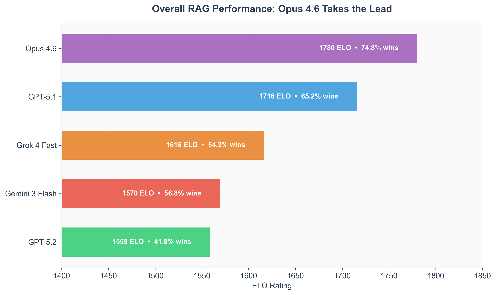
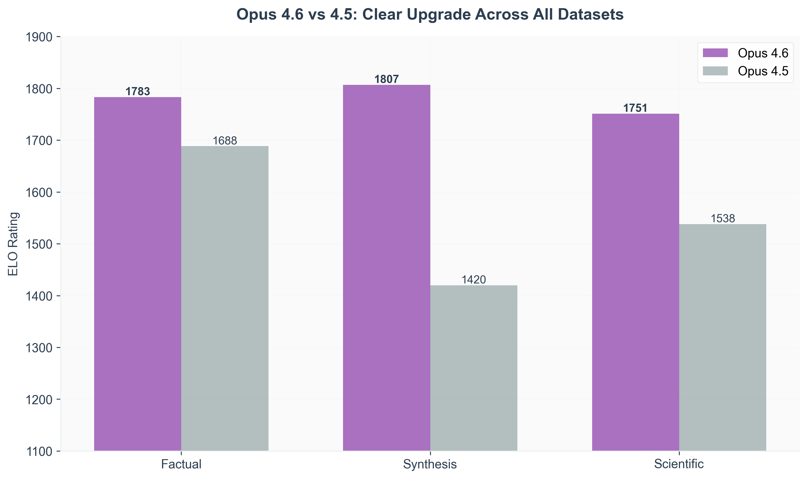
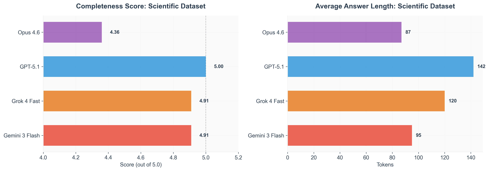
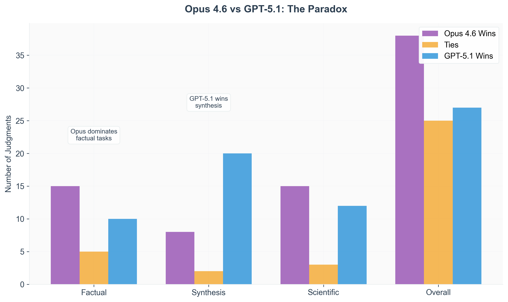
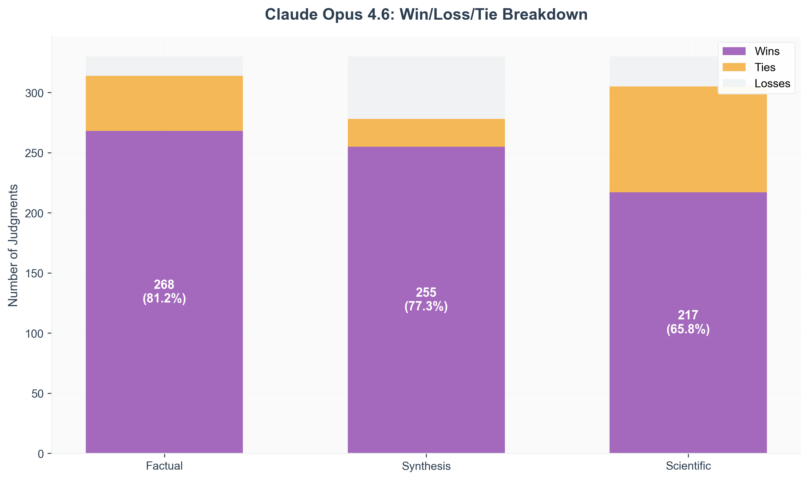
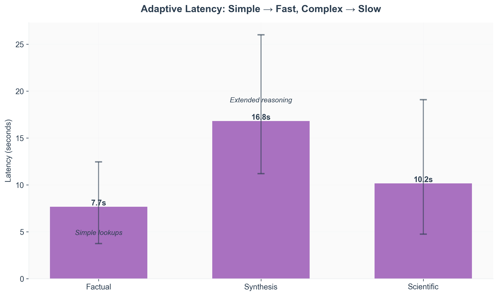

# Testing Claude Opus 4.6 in RAG: What We Found

**Umida Muratbekova** | [agentset.ai](https://agentset.ai) | February 6, 2026

Anthropic dropped Claude Opus 4.6 yesterday. We immediately ran it through our RAG evaluation pipeline to see how it actually performs on question-answering tasks. Here's what we found.

## TL;DR

Opus 4.6 is excellent at factual retrieval but surprisingly concise. It's a clear upgrade from 4.5, though GPT-5.1 still edges it out on long-form reasoning tasks. Your choice depends on whether you prioritize precision or comprehensiveness.

## The Setup

We tested Opus 4.6 on 90 queries across three types of tasks:

- **Factual retrieval** (30 queries): Straightforward information lookup
- **Long-form synthesis** (30 queries): Complex reasoning and narrative building
- **Scientific claims** (30 queries): Technical verification and evidence evaluation

Each model gets the same top-15 documents from our reranker, generates an answer, then we use pairwise comparison (GPT-5 as judge) to evaluate against 11 other frontier models. Think of it like chess ELO ratings, but for language models answering questions.

## Overall: Opus 4.6 Takes the Lead

Opus 4.6 scored **1780 ELO with a 74.8% win rate** (740 wins out of 990 total judgments). That's the highest overall score we've recorded in our benchmark.

But here's where it gets interesting.

## What Opus 4.6 Does Really Well

### Factual Retrieval: Unbeatable

On straightforward factual queries, Opus 4.6 absolutely dominated. **81.2% win rate** (268-16-46 record). When we manually reviewed the answers, we found zero hallucinations. Zero.

The model seems to have a strong "grounding reflex"—if the answer isn't clearly in the documents, it says so rather than making something up. This is exactly what you want in a RAG system.

### Clear Upgrade from 4.5

The improvement over Opus 4.5 is substantial across all task types. The biggest jump is in synthesis tasks (+387 ELO), where 4.5 was frankly embarrassing. Anthropic clearly identified and fixed something fundamental about long-context reasoning between versions.

## What We Didn't Expect

### The Conciseness Issue

Opus 4.6 writes short answers. Really short. On scientific queries, it averaged 87 tokens compared to GPT-5.1's 142 tokens.

This shows up in the completeness scores. Opus 4.6 scored **4.36/5.0** on completeness for scientific tasks, while GPT-5.1 got a perfect 5.0. The answers are correct and well-grounded, but they're missing supporting details that make for comprehensive explanations.

If you're building a system that needs to provide thorough, detailed responses—think technical documentation or educational content—this matters.

### The GPT-5.1 Paradox

Here's something counterintuitive: Opus 4.6 has a higher overall ELO (1780 vs 1716), but it actually *loses* head-to-head against GPT-5.1.

On synthesis tasks, GPT-5.1 beat Opus 4.6 20-8-2 in decisive matchups. The ELO system aggregates performance across all opponents—Opus 4.6 dominated weaker models more consistently, while GPT-5.1 struggled there but excelled on complex tasks.

**What this means practically:** Don't just look at overall leaderboard rankings. If your use case is specifically long-form content generation, GPT-5.1 might be the better choice even though it ranks lower overall.

Also, I should mention: our judge is GPT-5, which might have some preference for GPT-5.1's style. We can't rule out evaluation bias completely.

## Performance Breakdown by Task Type

The pattern is clear:
- **Factual tasks**: Opus 4.6 crushes it (81.2% wins)
- **Synthesis tasks**: Still strong but not dominant (77.3% wins)
- **Scientific tasks**: Good but with high tie rates (65.8% wins, 26.7% ties)

Those ties in scientific tasks? Often the models gave similar quality answers, but Opus 4.6's were shorter. The judge couldn't decisively call one better.

## Latency: Adaptive Compute

Something we noticed: Opus 4.6's latency varies significantly based on query complexity.

- Factual lookups: **7.7s average** (range: 3.7s - 12.5s)
- Synthesis tasks: **16.8s average** (range: 11.2s - 26.0s)
- Scientific tasks: **10.2s average** (range: 4.7s - 19.1s)

It's clear the model is adaptively allocating compute. Simple questions get fast answers, complex reasoning triggers extended thinking. This is actually pretty smart behavior for a production system—you don't want to waste compute on easy queries.

## Cost Analysis

Running 90 queries cost us **$2.99** total at Opus 4.6's pricing ($5/M input, $25/M output).

For context:
- Gemini 3 Flash would cost ~$0.30 for the same workload
- But Gemini 3 Flash also loses to Opus 4.6 in 68% of matchups

Sometimes you pay for quality. Whether it's worth it depends on your margin per query.

## So Should You Use It?

**Use Opus 4.6 when:**
- Maximum accuracy on factual queries is critical
- You need strong grounding in source documents
- 10-20s latency is acceptable for your use case
- Budget allows $5/$25 per M tokens

**Consider alternatives when:**
- Long-form synthesis is required → **GPT-5.1** (superior on synthesis, more comprehensive)
- Comprehensive coverage matters → **GPT-5.1** (perfect completeness scores)
- Speed is critical → **Grok 4 Fast** (3x faster, only ~10% quality drop)
- Budget constrained → **Gemini 3 Flash** (1/10th the cost, competitive quality)

## Final Take

Opus 4.6 is the strongest all-around RAG model we've tested, but "all-around" doesn't mean "best at everything."

**Strengths:**
- Best-in-class factual retrieval and grounding
- Massive improvement over 4.5 on complex reasoning
- Adaptive latency shows thoughtful engineering

**Weaknesses:**
- Too concise for comprehensive technical content
- Loses to GPT-5.1 on long-form synthesis
- Premium pricing and moderate latency

If your RAG system prioritizes precision and grounding over verbosity, Opus 4.6 is worth the cost. If you need comprehensive, detailed responses or your budget is tight, there are better options.

The upgrade from 4.5 is real, and Anthropic is clearly moving fast on long-context capabilities. We'll keep tracking these models as they evolve.

---

**Methodology note:** 90 queries, 990 new pairwise judgments using GPT-5 as judge, reusing 1,650 existing judgments between baseline models. Evaluated on MSMARCO, Paul Graham essays, and SciFact datasets. Code and data available at [github.com/agentset-ai/llm-leaderboard](https://github.com/agentset-ai/llm-leaderboard).

**Contact:** [hello@agentset.ai](mailto:hello@agentset.ai)
