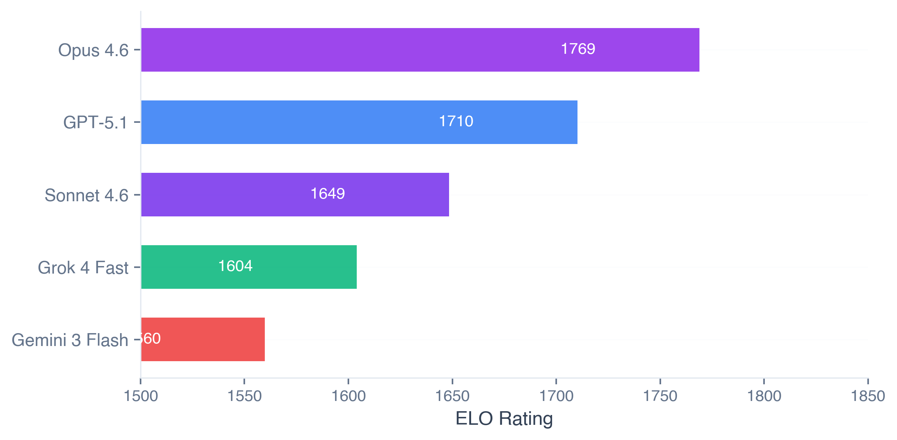
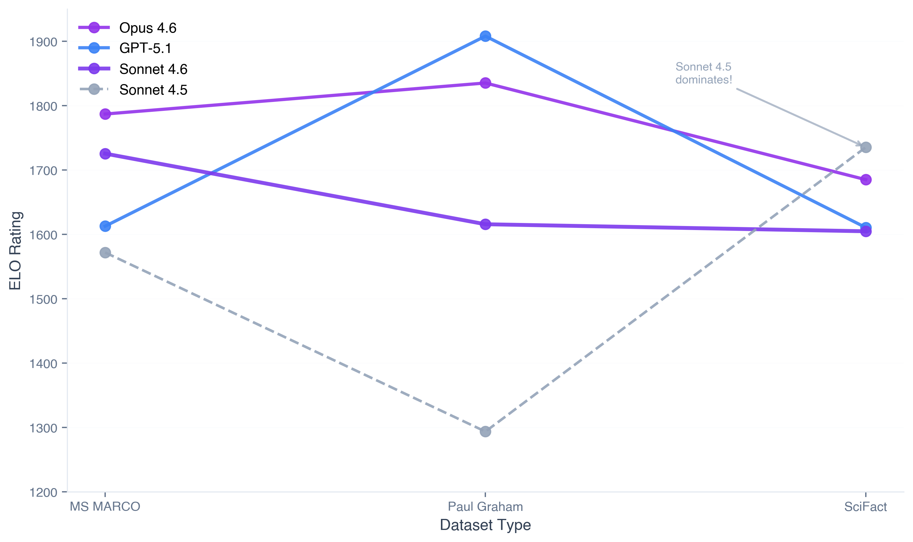
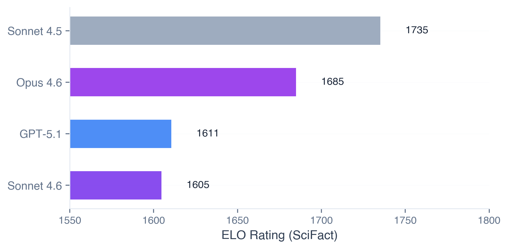
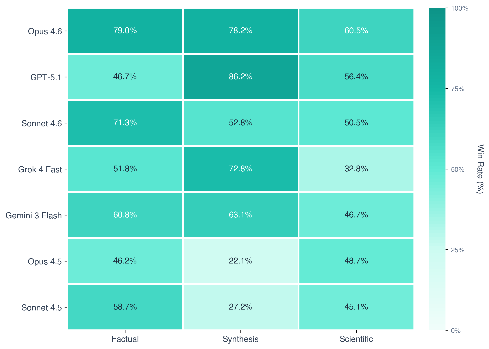
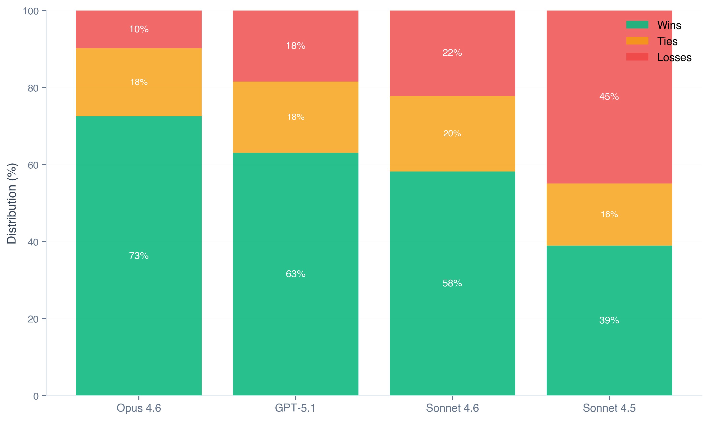
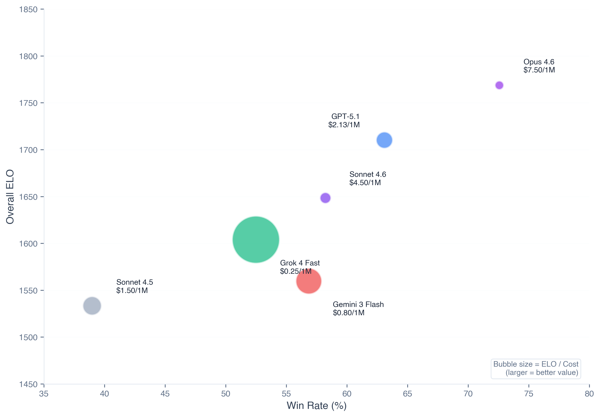

# Claude Sonnet 4.6 for Production RAG

Anthropic released Claude Sonnet 4.6, and we added it to our LLM for RAG leaderboard and tested how it behaves across three common workloads:

- **Factual QA** (web-style passages)
- **Long-form synthesis** (essay / narrative content)
- **Scientific verification** (claims grounded in papers)

**tldr**: Sonnet 4.6 placed #3 overall with a **58.5% win rate** against 13 other models. Biggest win was on long-form synthesis. Main failure mode: over-explaining on scientific/technical queries where brevity matters.

---

## Setup

14 models, 3 datasets, 30 queries each. Pairwise comparisons judged by GPT-5. Reasoning mode enabled for Sonnet 4.6.

| Rank | Model | Win Rate |
|------|-------|----------|
| 1 | Opus 4.6 | 74.5% |
| 2 | GPT-5.1 | 64.4% |
| **3** | **Sonnet 4.6** | **58.5%** |
| 4 | Grok 4 Fast | 52.5% |
| 5 | Gemini 3 Flash | 56.8% |
| 7 | Sonnet 4.5 | 39.0% |

Sonnet 4.6 costs **$4.50 per 1M tokens** vs Opus 4.6 at $7.50 (**40% cheaper**).

---

## Factual QA: clean extraction, low hallucination

Sonnet 4.6 was strong on factual QA (MS MARCO). **71.4% win rate** on this dataset, second only to Opus 4.6.

What we saw: it pulled answers directly from retrieved passages and avoided filler. When the relevant chunk wasn't in the retrieved set, it still produced plausible answers instead of refusing - both a strength (sounds confident) and a risk (subtle hallucinations).

Sonnet 4.5 had a **62.6% win rate** on the same task - similar behavior but shorter, less complete answers.

---

## Synthesis: biggest improvement over 4.5

Synthesis is where Sonnet 4.6 improved the most. It was better at **keeping a single thread** across multiple chunks and producing coherent answers.

On Paul Graham essays:
- Sonnet 4.6: **52.8% win rate**
- Sonnet 4.5: **22.1% win rate**

The gap comes from **answer depth**:
- Sonnet 4.5: **336 tokens average** - concise, factual
- Sonnet 4.6: **498 tokens average** (+48%) - more comprehensive, makes connections
- GPT-5.1: **1554 tokens average** (+363%) - exhaustive

Example: "What's the difference between wealth and money?"
- **4.5** (268 tokens): Clear distinction, basic explanation
- **4.6** (375 tokens): Same + "wealth is not a fixed pie", businesses create wealth not money, more examples

For essay/narrative content, **4.6's depth wins**. For terse technical docs, **4.5's brevity** can be better.

---

## Scientific verification: good but less conservative

On scientific claim verification (SciFact), Sonnet 4.6 was solid but **less conservative** than 4.5.

**Surprising result**:
- Sonnet 4.5: **48.7% win rate** (#1 rank)
- Sonnet 4.6: **50.5% win rate** (#4 rank)

But 4.5 beat 4.6 in **64% of their head-to-head matchups** on this dataset.

Why 4.5 wins on scientific claims:
- Sticks closer to source text
- Shorter answers (less room for errors)
- Literal interpretation of claims
- Less inference = fewer mistakes on technical content

Why 4.6 loses:
- Attempts to synthesize across papers
- More elaborate explanations
- More creative connections = more room for subtle mistakes

For **scientific/medical/legal RAG**, 4.5's cautious approach might be preferable.

---

## Performance across dataset types

| Dataset | Sonnet 4.6 | Sonnet 4.5 |
|---------|------------|------------|
| MS MARCO (Factual) | 71.4% win rate (#2) | 62.6% (#5) |
| Paul Graham (Synthesis) | 52.8% (#5) | 22.1% (#11) |
| SciFact (Scientific) | 50.5% (#4) | **48.7% (#1)** |

Heatmap shows clear pattern: **4.6 dominates general content, 4.5 excels at scientific precision**.

Consistency:
- **Sonnet 4.6 performs within 6% across all datasets** (very consistent)
- Sonnet 4.5 swings from 22% to 63% win rate (specialist)

---

## Win/loss breakdown across all matchups

- Opus 4.6: **74.5% wins**, 20.4% losses
- GPT-5.1: **64.4% wins**, 26.4% losses
- **Sonnet 4.6: 58.5% wins**, 30.8% losses
- Sonnet 4.5: 39.0% wins, 55.9% losses

Sonnet 4.6 wins more than it loses against the entire field. Not dominant like Opus, but solid across workloads.

---

## Head-to-head: Sonnet 4.6 vs 4.5

Direct comparison across all 90 queries:
- **Sonnet 4.6 wins: 63%**
- Ties: 8%
- Sonnet 4.5 wins: 29%

4.6 wins **2.2x more often** than 4.5 overall. The 29% where 4.5 wins are heavily concentrated on scientific/technical queries.

---

## Cost comparison

Bubble size = performance per dollar (larger = better value).

| Model | Cost (per 1M tokens) | Win Rate | Value |
|-------|----------------------|----------|-------|
| Sonnet 4.6 | **$4.50** | 58.5% | **Balanced** |
| Sonnet 4.5 | $1.50 (-67%) | 39.0% | Budget |
| Opus 4.6 | $7.50 (+67%) | 74.5% | Premium |
| GPT-5.1 | $2.13 (-53%) | 64.4% | **Best value** |

For 100k queries/month (assuming 10:1 input/output ratio):
- Sonnet 4.6: **$450/month**
- Sonnet 4.5: $150/month (save $300, drop 20% win rate)
- Opus 4.6: $750/month (spend $300 more, gain 16% win rate)
- GPT-5.1: $213/month (save $237, gain 6% win rate)

---

## When to use which

### Use Sonnet 4.6 if:
- General RAG (customer support, docs, search)
- Long-form synthesis (essays, blogs, narrative)
- You need **consistent performance** across content types
- Cost/quality balance matters

### Use Sonnet 4.5 if:
- Scientific/technical verification
- You prefer **brevity over elaboration**
- Budget is tight (33% cheaper)
- Workload is primarily technical documents

### Use Opus 4.6 if:
- Mission-critical accuracy (legal, medical, financial)
- Budget allows premium performance
- Need the **highest win rate** (74.5%)

---

## Takeaway

**Sonnet 4.6 is a strong general-purpose RAG model** (58.5% win rate, #3 overall).

**Main strength**: Long-form synthesis. On narrative content, it **wins 2.4x more often** than 4.5 (52.8% vs 22.1%).

**Main weakness**: Over-explains on technical content. On scientific verification, 4.5 beats 4.6 in **64% of head-to-head matchups**.

**Upgrade recommendation**: Upgrade 4.5 → 4.6 unless your workload is predominantly scientific/technical. The **+19.5% win rate gain** comes at a **3x cost increase** ($1.50 → $4.50), so evaluate based on your volume and quality requirements.

---

## Methodology note

During evaluation, we found a caching bug where Sonnet 4.5's judgments were reused from runs **without retrieved documents**. After fixing and re-running with proper context, 4.5 jumped from a 26.7% win rate to 39.0% and claimed #1 on SciFact. This highlights the importance of proper cache invalidation in RAG evaluation systems.

---

All code and data: [github.com/itsumida/llm-leaderboard](https://github.com/itsumida/llm-leaderboard)

*Built by [AgentSet](https://agentset.ai)*
